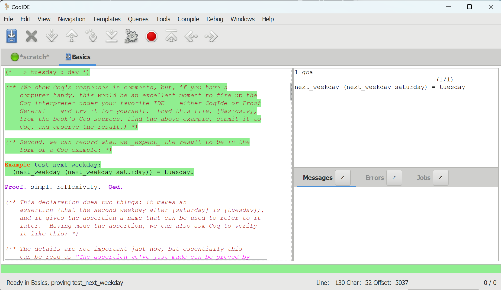
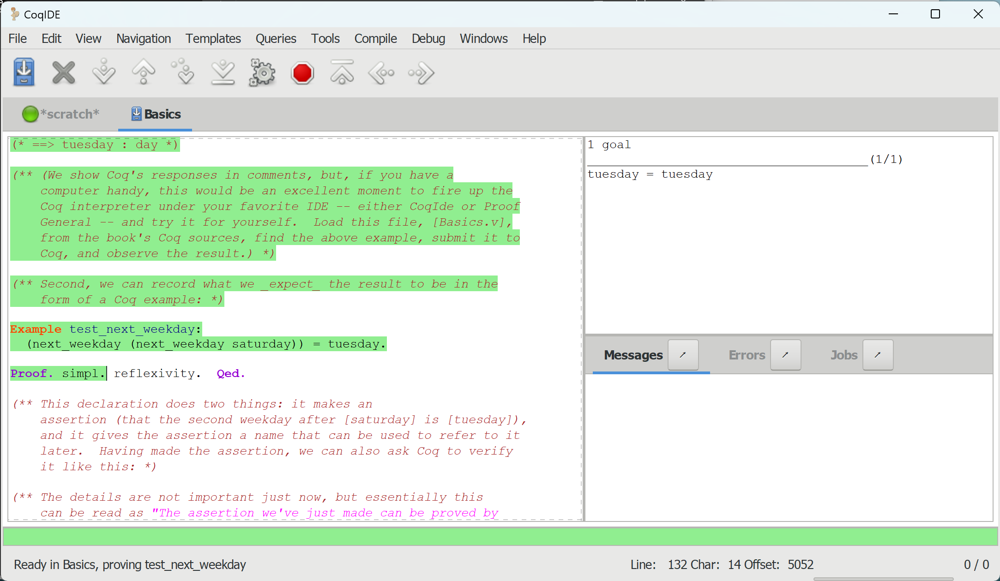
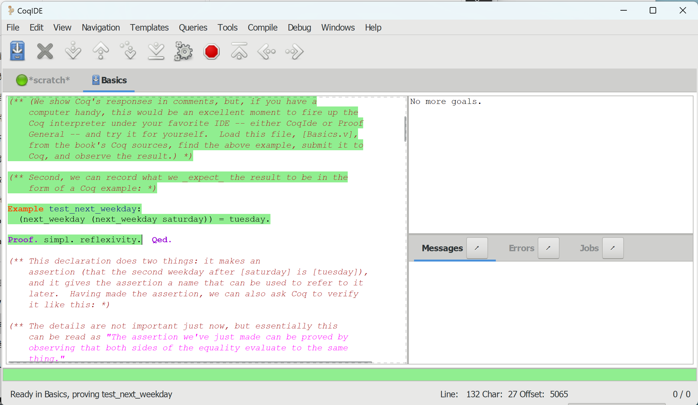
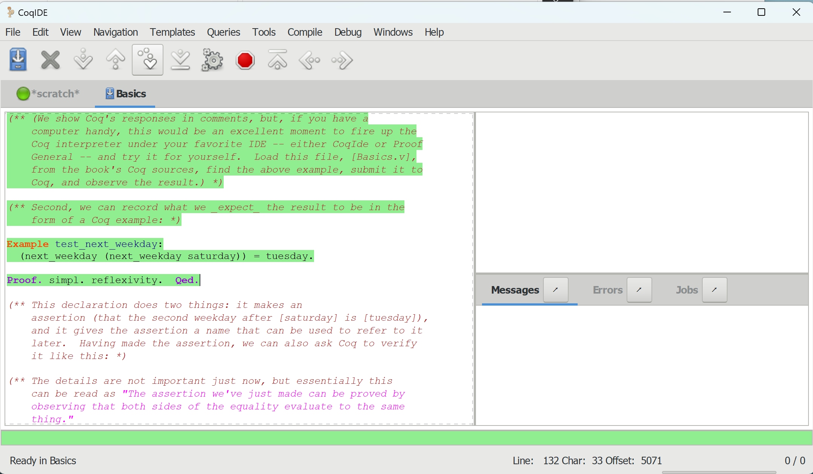
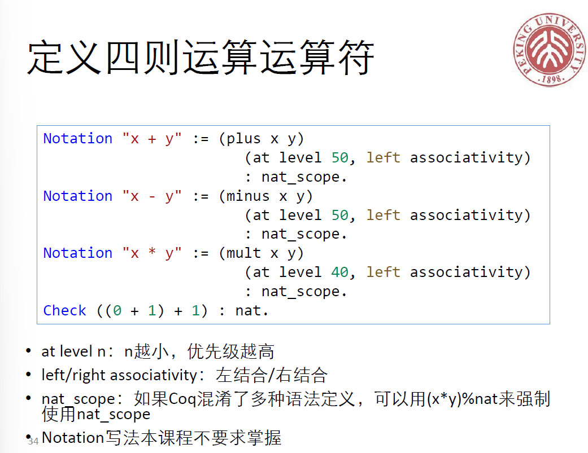

# Software Foundations

[Online Textbook](https://softwarefoundations.cis.upenn.edu/lf-current/index.html)

[Michael Clarkson's Open Online Course (on Youtube)](https://www.youtube.com/watch?v=BGg-gxhsV4E)
[Michael Charkson's Course (on Bilibili)](https://www.bilibili.com/video/BV1kd4y1t7bw/)

[Xiong Yingfei's Course Webpage (2023 Spring)](https://xiongyingfei.github.io/SF/2023/lectures.html)

This note is used as a brief summary and supplementofr the textbook and courses.


## Basics

### Enumerated Types

```Coq
Inductive day : Type :=
  | monday
  | tuesday
  | wednesday
  | thursday
  | friday
  | saturday
  | sunday.
```

```Coq
Definition next_weekday (d:day) : day :=
  match d with
  | monday    => tuesday
  | tuesday   => wednesday
  | wednesday => thursday
  | thursday  => friday
  | friday    => monday
  | saturday  => monday
  | sunday    => monday
  end.
```

Then we can do the computation.
```Coq
Compute (next_weekday friday).
(* ==> monday : day *)
```

Note that pattern-machine needs to be exhaustive, and cannot be redundant.

For example:

```Coq
Definition to_monday (d:day) : day := 
  match d with
  | monday => monday
  | tuesday => monday
  end.
(** [messages window]
    Non exhaustive pattern-matching: no clause found for pattern
    wednesday *)
```

```Coq
Definition to_monday (d:day) : day := 
  match d with
  | monday => monday
  | _ => monday
  | sunday => monday
  end.
(** [messages window]
    Pattern "sunday" is redundant in this clause. *)
```

### Function Call
Function call in Coq is by tapping the space bar, like `f a`, it is left associative (that is to say `f a b` is equal to `(f a) b`), and is with nearly the highest priority (i.e. `f a + b` is equal to `(f a) + b`).

### Equality
There are two notions of equality in Coq: the equals operator and the equals question mark operator.
- The equals operator is a logical claim, means something we try to prove. Currently we only use this .
- The equals question mark operator is an expression that Coq computes. Notation `x=?y`, `x<=?y` use question to denote that this returns a boolean variable. 

### Theory Proof

Theory proof is the core of Coq, and it is with the form:

```Coq
Example test_next_weekday:
  (next_weekday (next_weekday saturday)) = tuesday.

Proof. simpl. reflexivity.  Qed.
```

Or we may proof `Lemma`, `Theorem`, etc. other than `Example`.

In the CoqIde, we can observe the proof process step by step with the help of 'Run  to curser' icon.

Take the above proof process as an example:










### Notation 

Programmers can introduce new grammar rule.

```Coq
Notation "x && y" := (andb x y).
Notation "x || y" := (orb x y).
```


```Coq
Notation "x =? y" := (eqb x y) (at level 70) : nat_scope.
Notation "x <=? y" := (leb x y) (at level 70) : nat_scope.
```

### `if-then-else` in Coq

`if-then-else`  in Coq is quite different than in other languages, as type bool is not inherented in Coq. 

In Coq, `if` can be applied to any type with two constructors. If the condition variable is constrcted by the first, go to `then`, otherwise go to `else`.

```Coq
Inductive nbool : Type :=
  | first
  | second.

Definition trans (t : nbool) : nbool :=
  if t then second
  else first.

Example exp1 : trans first = second.
Proof. simpl. reflexivity. Qed.
```

### Check 

Used to inspect the type of expressions. (variables and functions), for example: 

```Coq
Check true.
Check true : bool.
Check orb : bool -> bool -> bool.
```

bool $\rightarrow$ bool means a function with input of a bool variable and output of a bool variable. (just like Haskell).
$\rightarrow$ is right associative.


### Details of symbl. and reflexivity.

Coq syntax
1. Vernacular: Give commands to change what Coq is doing. Include `Check`, `Theorem`, `Proof`, `Qed` etc. 
2. Gallina: Functional programming language, write code and state theorem with this. Include `match`, `if`, `forall`.
3. Ltac: Language for tactics, structure proofs into sections. Include `intros`, `simpl`, `reflexivity`, `destruct`.

Lambda calculus (Theoretical underpinning of functional programming). $e ::= x | \lambda x . e | e_1 e_2$

Reduction tactics
- `simpl.`: "human readable"
- `cbn.`: call by name, try it if `simpl.` doesn't work.
- `cbv.`: call by value, fully compute. Its result may be big and hard to read, unlike `simpl.`.

Gallina (more than $\lambda$)
Definitions (delta reduction)
Inductive types, patter matching; recursion (iota reduction); Let bindings (zeta reduction)

<!-- make this paragraph readable -->


### Module System

`Module` in Coq is like `namespace` in C++ and `package` in Java.

### Natural Number

Definition of natural number

```Coq
Inductive nat : Type :=
  | O
  | S (n : nat).
```

Note that number 0 is denoted by captial letter O.
`S` represents `succ` in some other languages.

### Recursive Function

Recursive function is defined by keyword `Fixpoint`, i.e. 

```Coq
Fixpoint even (n:nat) : bool :=
  match n with
  | O        => true
  | S O      => false
  | S (S n') => even n'
  end.


Fixpoint eqb (n m : nat) : bool :=
  match n with
  | O => match m with
         | O => true
         | S m' => false
         end
  | S n' => match m with
            | O => false
            | S m' => eqb n' m'
            end
  end.
```

Coq only allows structural recursion.


### `intros`

Introduce hypothesis including variable quantifiers and hypothesis (those before the right arrow).

```Coq
Theorem plus_id_example : forall n m:nat,
  n = m ->
  n + n = m + m.

Proof.
  (* move both quantifiers into the context: *)
  intros n m.
  (* move the hypothesis into the context: *)
  intros H.
  (* rewrite the goal using the hypothesis: *)
  rewrite -> H.
  reflexivity.  Qed.
```

Right arrow and left arrow are different in `rewrite` expression.  In the above example, `n` is replaced by `m`, and in the following one, `(p * 0)` is replaced by `0`.

```Coq
(* mult_n_O ===> forall n : nat, 0 = n * 0 *)

Theorem mult_n_0_m_0 : forall p q : nat,
  (p * 0) + (q * 0) = 0.

Proof.
  intros p q.
  rewrite <- mult_n_O.
  rewrite <- mult_n_O.
  reflexivity. Qed.
```

### `destruct`


```Coq
Theorem plus_1_neq_0 : forall n : nat,
  (n + 1) =? 0 = false.

Proof.
  intros n. destruct n as [| n'] eqn:E.
  - reflexivity.
  - reflexivity.   Qed.
```
(`[| n']` is equal to `[O | S n']`)

In the proof process above, `destruct` divide it into two subgoals. The first is to prove that `(0 + 1 =? 0) = false`, the second is to prove that `(S n' + 1 =? 0) = false`. In the first subgoal, `eqn:E` name the hypothesis n=0 as E.

Two `reflexivity.` with a dash in front solves one subgoal, respectively.

Here is another example of two variables need subgoal division. 
```Coq
Theorem andb_commutative : forall b c, andb b c = andb c b.
Proof.
  intros b c. destruct b eqn:Eb.
  (* b = true *)
  - destruct c eqn:Ec.
    + reflexivity.  (* c = true *)
    + reflexivity.  (* c = false *)
  (* b = false *)
  - destruct c eqn:Ec.
    + reflexivity.  (* c = true *)
    + reflexivity.  (* c = false *)
Qed.
```

Besides `+` and `-`, Coq also permits other notations, like braces.


